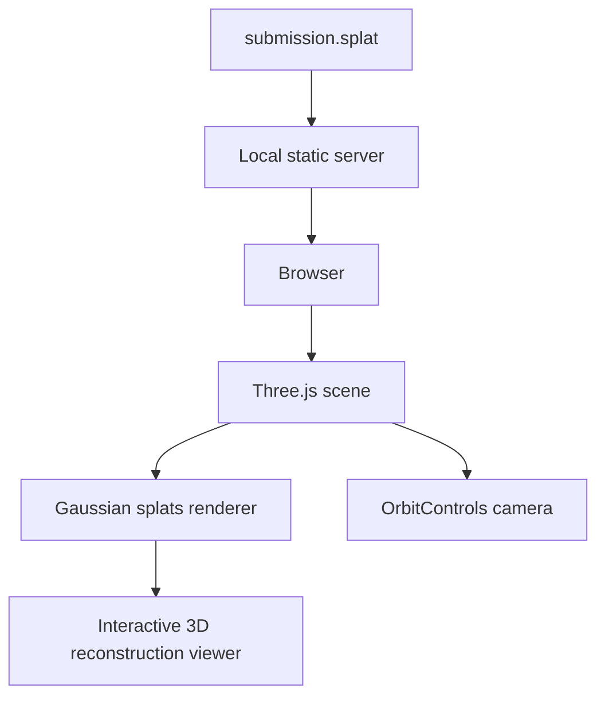

# AR/VR Neural Reconstruction Viewer

Browser-based Gaussian Splat viewer for inspecting reconstructed 3D assets in an interactive AR/VR-oriented scene.

> Repository rename recommendation: `neural-reconstruction-viewer` or `gaussian-splat-ar-viewer`.

## Why This Project Matters

3D reconstruction projects are only impressive when the result can be inspected. This viewer turns a `.splat` asset into an interactive browser scene, making reconstruction output easier to demo, evaluate, and share. It is a natural companion to Gaussian Splatting pipelines such as `quicksplat`.

The project demonstrates practical 3D systems work: local asset serving, Three.js scene setup, orbit controls, Gaussian splat rendering, and browser-based visual debugging.

## Features

| Capability | Description |
|---|---|
| Gaussian splat loading | Renders `.splat` assets from the local `assets/data` path. |
| Interactive camera | Orbit controls for rotation, zoom, and scene inspection. |
| Local server | Lightweight Node/Express server for browser-safe asset loading. |
| Web-first demo | Runs in a browser without a heavy desktop viewer. |
| Pipeline compatibility | Can be used as a demo surface for reconstructed assets from video-to-splat workflows. |

## System Architecture



## Tech Stack

| Layer | Technology |
|---|---|
| Runtime | Node.js |
| Server | Express |
| Rendering | Three.js |
| Interaction | OrbitControls |
| Asset format | Gaussian splat `.splat` |

## Installation

```bash
npm install
```

Important repository cleanup:

- Do not commit `node_modules/`.
- Add `node_modules/` to `.gitignore`.
- Keep large generated `.splat` files in Git LFS or attach them as release assets if they grow beyond normal GitHub repo size.

## Usage

```bash
npm start
```

Open the local URL printed by the server, usually:

```text
http://localhost:3000
```

To view a different reconstruction, place the asset under:

```text
assets/data/<model-name>/submission.splat
```

Then update the model path in the viewer script.

## Demo

Add:

```text
docs/demo/orbit-inspection.gif
docs/demo/reconstruction-closeup.png
docs/demo/mobile-view.png
```

Suggested GIF:

1. Load the splat.
2. Orbit around the object.
3. Zoom into reconstruction detail.
4. Show rendering from two camera angles.

## Folder Structure

```text
AR-VR-Neural_Reconstruction_hornbill_elephant/
├── assets/
│   └── data/
│       └── myModel/
│           └── submission.splat
├── js/
│   └── util.js
├── libs/
│   ├── three.module.js
│   ├── OrbitControls.js
│   └── gaussian-splats-3d.module.js
├── index.html
├── server.js
├── package.json
└── README.md
```

## Challenges Faced

- Serving binary reconstruction assets correctly in the browser.
- Keeping the viewer lightweight while still handling dense 3D data.
- Making reconstruction results inspectable without requiring specialized desktop tools.

## Future Improvements

- Add drag-and-drop `.splat` loading.
- Add scene presets for lighting, camera, and background.
- Add screenshot/export controls.
- Add FPS and memory diagnostics overlay.
- Add WebXR mode for headset-based inspection.
- Connect directly to `quicksplat` output folders for local demos.

## Troubleshooting

| Symptom | Likely Cause | Fix |
|---|---|---|
| Blank screen | Asset path is wrong or server is not running | Check DevTools network tab and confirm `.splat` loads with 200 status. |
| CORS or file loading error | Opened `index.html` directly | Run the Node server instead of using `file://`. |
| Viewer is slow | Splat is too large for GPU/browser | Test with a smaller reconstruction or decimated asset. |
| Repo is huge | `node_modules` or large assets committed | Remove `node_modules`; use Git LFS or releases for large splats. |

## License

Recommended: MIT, with attribution notes for any third-party splat viewer library used.
